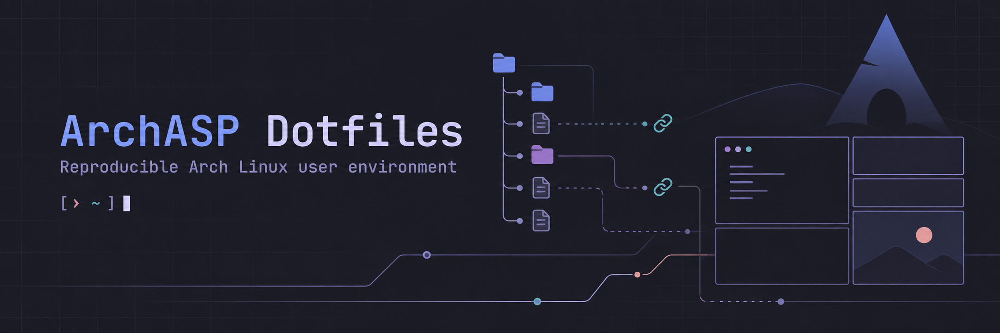
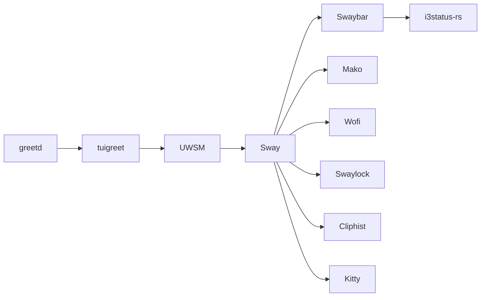
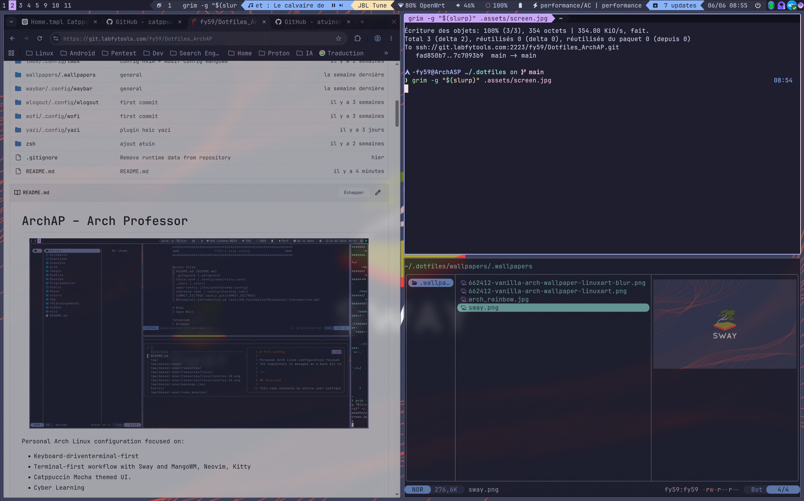

<p align="center">
  
</p>

<h1 align="center">ArchASP Dotfiles</h1>

<p align="center">
  Environnement utilisateur Arch Linux reproductible, composé avec GNU Stow.
</p>

<p align="center">
  
  
  
  
</p>

<p align="center">
  <a href="#-overview">Overview</a> ·
  <a href="#-stack">Stack</a> ·
  <a href="#-preview">Preview</a> ·
  <a href="#-quick-start">Quick Start</a> ·
  <a href="#-documentation">Documentation</a> ·
  <a href="#-version">Version</a>
</p>

## ✦ Overview

`Dotfiles_ArchAP` décrit la couche **utilisateur** d'ArchASP : session Wayland,
shell, applications terminal, scripts personnels et unités systemd user. Chaque
package reproduit son chemin sous `$HOME` et GNU Stow déploie les liens
symboliques correspondants.

L'administration système reste séparée dans
[`arch-system`](https://git.labfytools.com/fy59/arch-system) : installation
Arch, boot, stockage, réseau, paquets, `/etc` et helpers root. Les inventaires
de ce dépôt documentent la machine réelle, mais ne constituent pas un
installateur automatique.

## ✦ Stack

| Desktop | Shell |
| --- | --- |
| `greetd → tuigreet → UWSM → Sway` | `Zsh → Starship → Atuin` |
| `Swaybar → i3status-rs` | `FZF → Zoxide → Eza → Bat → Yazi` |
| Mako · Wofi · Swaylock · Cliphist · Kitty | plugins Zsh et Tmux épinglés par sous-modules |



Les responsabilités et dépendances sont détaillées dans
[`docs/desktop.md`](docs/desktop.md) et [`docs/shell.md`](docs/shell.md).

## ✦ Preview

<p align="center">
  
</p>

<p align="center"><sub>Environnement ArchASP réel — Sway, applications terminal et palette Catppuccin.</sub></p>

## ✦ Repository

```text
ArchASP
├── arch-system       système/root · /etc · services système · installation
└── Dotfiles_ArchAP   utilisateur · $HOME · Stow · systemd --user
```

Les 31 packages Stow couvrent le desktop, le shell, le développement, les
services utilisateur et l'apparence. `.assets/` contient les inventaires de
reconstruction ; `docs/` contient la documentation et n'est jamais un package
Stow. Voir le [contrat d'architecture](docs/architecture.md).

## ✦ Quick Start

Le chemin heureux utilise Bash pour le tableau des packages :

```bash
git clone --recurse-submodules \
  ssh://git@git.labfytools.com:2223/fy59/Dotfiles_ArchAP.git \
  "$HOME/.dotfiles"
cd "$HOME/.dotfiles"

packages=(atuin bat bin btop cliphist eza fastfetch fzf gtk-3.0 gtklock \
  hyprwhspr i3status-rust icons kitty mako nvim opencode qt5ct qt6ct \
  starship sway swaylock systemd themes tmux uwsm wallpapers wofi yazi \
  ytmusic-tui zsh)

stow --no --verbose=2 --target="$HOME" "${packages[@]}"
stow --verbose=2 --target="$HOME" "${packages[@]}"
```

Le dry-run doit être examiné avant le déploiement. Les prérequis, conflits,
inventaires et validations sont décrits dans le
[guide d'installation](docs/installation.md).

## ✦ Documentation

| Guide | Sujet |
| --- | --- |
| [Documentation](docs/README.md) | Index et responsabilités des documents |
| [Architecture](docs/architecture.md) | Frontières ArchASP, Stow et données locales |
| [Installation](docs/installation.md) | Clone neuf, sous-modules, Stow et validations |
| [Desktop](docs/desktop.md) | Chaîne greetd/UWSM/Sway et composants Wayland |
| [Shell](docs/shell.md) | Zsh, outils interactifs, plugins et scripts |
| [systemd](docs/systemd.md) | Services système et unités utilisateur |
| [Packages](docs/packages.md) | Inventaires Pacman, AUR, services et outils externes |
| [Recovery](docs/recovery.md) | Reconstruction complète après perte du disque |
| [Security](docs/security.md) | Secrets exclus et règles de publication |

## ✦ Mirrors

| Rôle | Dépôt |
| --- | --- |
| Upstream principal | [Forgejo](https://git.labfytools.com/fy59/Dotfiles_ArchAP) |
| Miroir public | [GitHub](https://github.com/labfytools/Dotfiles_ArchAP) |

Le fetch d'`origin` reste attaché à Forgejo. Ses deux URLs de push publient
vers Forgejo et GitHub.

## ✦ Version

| Branche | Rôle |
| --- | --- |
| `0.1.0` | Snapshot stable de la première version nettoyée et documentée |
| `main` | Développement courant |

La branche stable est immobile : les développements suivants avancent sur
`main` sans déplacer automatiquement `0.1.0`.

## ✦ License

Aucune licence n'est actuellement déclarée pour ce dépôt. En l'absence de
licence, aucun droit de réutilisation n'est accordé implicitement.
