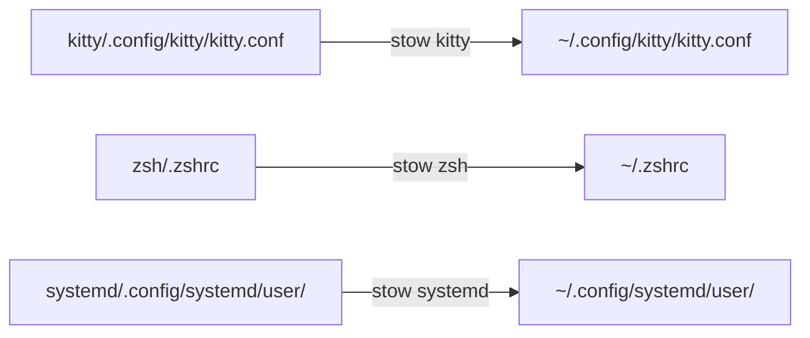

# Architecture

## Contrat global

ArchASP sépare volontairement la couche système de la couche utilisateur.

```mermaid
flowchart TB
    A[ArchASP] --> S[arch-system]
    A --> D[Dotfiles_ArchAP]
    S --> SR[Installation Arch · boot · stockage · réseau]
    S --> SE[/etc · services système · helpers root]
    D --> DH[$HOME · configuration utilisateur]
    D --> DU[Stow · systemd --user · scripts]
```

| Couche | Possède | Ne possède pas |
| --- | --- | --- |
| `arch-system` | installation, partitions, boot, paquets de base, `/etc`, greetd installé, services système, helpers `/usr/local` | préférences et fichiers sous `$HOME` |
| `Dotfiles_ArchAP` | session utilisateur, shell, applications terminal, scripts, thèmes, unités `systemd --user` | configuration root, secrets, données applicatives |

La copie de référence de greetd située dans `.assets/greetd/config.toml`
documente l'intégration, mais son installation dans `/etc/greetd` appartient
à `arch-system`.

## Contrat GNU Stow

Chaque package de premier niveau reproduit une arborescence relative à
`$HOME`. GNU Stow crée les liens symboliques ; le dépôt reste la source du
fichier versionné.



Exemples de correspondance :

| Source versionnée | Cible utilisateur |
| --- | --- |
| `sway/.config/sway/` | `~/.config/sway/` |
| `i3status-rust/.config/i3status-rust/` | `~/.config/i3status-rust/` |
| `bin/.local/bin/` | `~/.local/bin/` |
| `zsh/.zprofile` | `~/.zprofile` |
| `wallpapers/.wallpapers/` | `~/.wallpapers/` |

Les packages Stow sont une liste explicite de 31 noms, détaillée dans le
[guide d'installation](installation.md). Il ne faut pas déduire cette liste de
tous les répertoires de premier niveau : `.assets/` et `docs/` ne sont pas des
packages. Il ne faut jamais exécuter `stow .`.

## Frontières de propriété

### Dans les dotfiles

- configuration déclarative sous `$HOME` ;
- scripts personnels déployés dans `~/.local/bin` ;
- unités et liens d'activation `systemd --user` ;
- thèmes, icônes et fonds d'écran nécessaires à l'environnement ;
- inventaires de reconstruction sous `.assets/` ;
- références Git des plugins Zsh et Tmux via sous-modules.

### Dans `arch-system`

- opérations privilégiées et fichiers sous `/etc` ;
- activation des services système, dont greetd ;
- configuration du boot, du stockage, du réseau et de la sécurité système ;
- helpers locaux sous `/usr/local` ;
- restauration initiale des paquets sur une installation minimale.

### Dans les projets externes

Trainlog, Lardon, Arch Sentinel, OpenMVS et les autres projets locaux gardent
leur code, leurs builds et leurs données dans leurs propres dépôts. Les
dotfiles peuvent référencer leurs commandes ou unités, sans en devenir la
source. Les chemins attendus sont inventoriés dans
[`external-tools.md`](../.assets/external-tools.md).

### Machine-local ou secret

Les bases applicatives, caches, historiques, identités SSH/GPG, clés Atuin,
tokens, cookies et credentials ne sont ni des dotfiles ni des dépendances à
publier. Ils doivent être restaurés séparément depuis une sauvegarde sûre. La
[politique de sécurité](security.md) détaille cette frontière.
