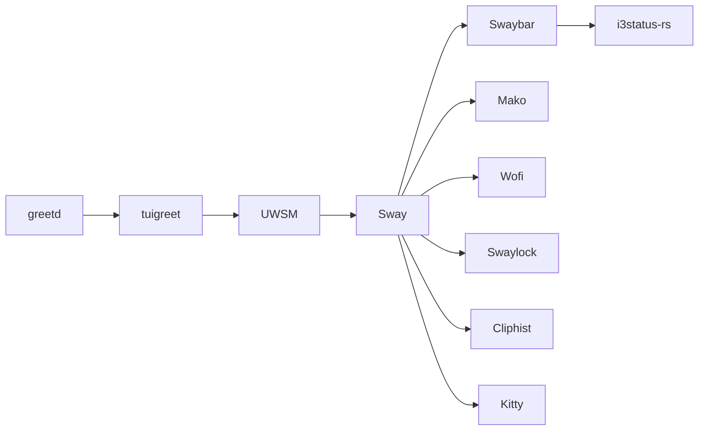

# Desktop

## Stack canonique



| Composant | Responsabilité | Propriété |
| --- | --- | --- |
| greetd | gestionnaire de connexion système | installé/configuré par `arch-system` |
| tuigreet | interface terminal de greetd | paquet système ; commande référencée par greetd |
| UWSM | cycle de vie de la session Wayland | package Stow `uwsm` et paquet système |
| Sway | compositeur et configuration de session | package `sway` |
| Swaybar | barre native de Sway | bloc `bar` de la configuration Sway |
| i3status-rs | contenu et modules de la barre | package `i3status-rust` |
| Mako | notifications Wayland | package `mako` |
| Wofi | lanceur d'applications | package `wofi` |
| Swaylock | verrouillage | package `swaylock`, appelé par les bindings et swayidle |
| Cliphist | historique texte/image du presse-papiers | package `cliphist` et unités user |
| Kitty | terminal principal | package `kitty` |

La configuration `uwsm/.config/uwsm/default-id` sélectionne `sway.desktop`.
La référence greetd de `.assets/greetd/config.toml` démarre la chaîne système,
mais sa copie dans `/etc` ne relève pas des dotfiles.

## Session Sway

Le package `sway` sépare la configuration principale, les bindings, les règles,
le style, la barre, l'autostart et les scripts. Swaybar exécute :

```text
i3status-rs ~/.config/i3status-rust/config.toml
```

Les scripts locaux sous `~/.config/sway/scripts` restent propres à la session.
Les commandes sous `~/.local/bin` sont fournies par le package `bin` ou, quand
cela est documenté, par un projet externe.

## Services de session

- `cliphist-text.service` et `cliphist-image.service` observent `wl-paste` ;
- `swayidle.service` verrouille, éteint/rallume les sorties et suspend les
  lecteurs selon les délais configurés ;
- `wlsunset.service` gère la température de couleur ;
- `gnome-keyring-daemon.service` et `ssh-agent.service` fournissent les agents
  de session ;
- Mako est le fournisseur de notifications retenu.

Les unités attachées à `graphical-session.target` ne remplacent pas UWSM :
elles consomment le cycle de vie de la session qu'UWSM expose à systemd user.

## Dépendances visibles

Les bindings Sway appellent notamment `pactl`, `brightnessctl`, `grim`,
`slurp`, `wl-copy`, `wofi`, `swaylock`, `yazi` et des scripts de
`~/.local/bin`. Les programmes spécifiques à des projets ou à la machine sont
inventoriés dans [`external-tools.md`](../.assets/external-tools.md).

Les anciens choix Mango, Waybar, SwayNC et Wlogout ne font pas partie de la
stack supportée. Leur éventuelle présence comme paquet installé ne leur donne
aucun rôle dans l'architecture actuelle.
