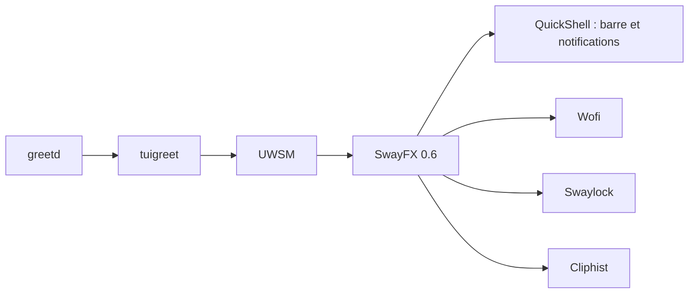

# Desktop

## Session actuelle

```mermaid
flowchart LR
    G[greetd] --> T[tuigreet] --> U[UWSM] --> S[SwayFX 0.6]
    S --> Q[QuickShell : barre et notifications]
    S --> W[Wofi]
    S --> L[Swaylock]
    S --> C[Cliphist]
```

`uwsm/.config/uwsm/default-id` sélectionne `sway.desktop` ; SwayFX fournit le
binaire Sway compatible. `sway/.config/sway/config` inclut `swayfx`, mais
aucune configuration `bar`. QuickShell démarre une seule fois par
`quickshell-labfy-sway.service`, attaché à
`wayland-session@sway.desktop.target`. Mako reste installé et masqué pour le
rollback des notifications.

La sortie interne `eDP-1` est positionnée à l'origine ; les paramètres SwayFX
sont conservés dans `sway/.config/sway/swayfx` : animations 0, coins 4,
ombres validées, flou global désactivé, flou réservé à la
couche QuickShell. Le script d'opacité inactive écoute l'IPC Sway au lancement
de la session.

## Services et outils

`labfy-quickshell-updates.timer` déclenche la vérification Arch/AUR sans
installer de paquet. `cliphist-text.service`, `cliphist-image.service`,
`swayidle.service`, `wlsunset.service`, les agents SSH et keyring restent des
unités utilisateur distinctes. Les raccourcis Sway utilisent notamment
`pactl`, `brightnessctl`, `grim`, `slurp`, `wl-copy`, `wofi`, `swaylock` et
`yazi`. Le détail de QuickShell et des dépendances figure dans son
[README](../quickshell/.config/quickshell/labfy-sway/README.md).
