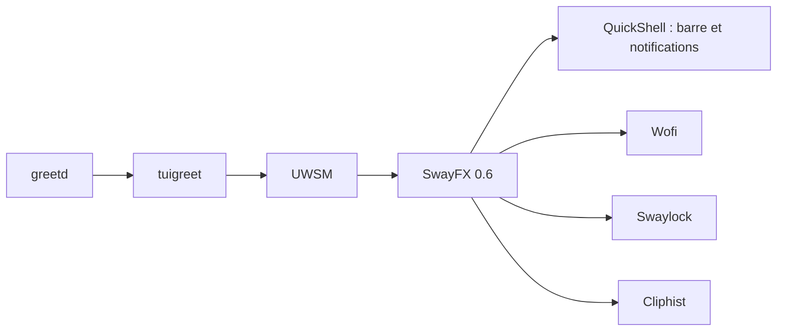

# Desktop

## Session actuelle

```mermaid
flowchart LR
    G[greetd] --> T[tuigreet] --> U[UWSM] --> S[SwayFX 0.6]
    S --> Q[QuickShell : barre et notifications]
    S --> W[Wofi]
    S --> L[Swaylock]
    S --> C[Cliphist]
```

`uwsm/.config/uwsm/default-id` sélectionne `sway.desktop` ; SwayFX fournit le
binaire Sway compatible. `sway/.config/sway/config` inclut `swayfx`, mais
aucune configuration `bar`. QuickShell démarre une seule fois par
`quickshell-labfy-sway.service`, attaché à
`wayland-session@sway.desktop.target`. Mako reste installé et masqué pour le
rollback des notifications.

La sortie interne `eDP-1` est positionnée à l'origine ; les paramètres SwayFX
sont conservés dans `sway/.config/sway/swayfx` : animations 0, coins 4,
ombres validées, flou global désactivé, flou réservé à la
couche QuickShell. Le script d'opacité inactive écoute l'IPC Sway au lancement
de la session.

## Décoration des fenêtres flottantes

Les fenêtres flottantes classiques utilisent une bordure serveur `pixel 2`,
sans barre de titre Sway. `sway/.config/sway/style` fixe les valeurs par défaut
pour les nouvelles fenêtres et les couleurs `client.*` : Lavender `#b4befe`
avec le focus, Surface2 `#6c7086` sans focus. Ces couleurs sont communes aux
fenêtres flottantes et en mosaïque ; SwayFX 0.6 ne fournit pas ici une palette
distincte selon le mode. La règle `[floating]` de `sway/.config/sway/rules`
couvre les fenêtres créées flottantes, y compris les dialogues. La règle
`labfy-yazi-filechooser` conserve son centrage et force cette même bordure
pour le sélecteur Yazi. L'abonné IPC existant
`scripts/inactive-windows-transparency.py` écoute aussi `window::floating`.
Il cible l'ID du conteneur devenu flottant, attend 50 ms que son éventuel mode
`csd` se stabilise, puis applique `border pixel 2` si nécessaire. La bordure
antérieure est rétablie lorsqu'il revient en mosaïque. Cela couvre aussi bien
le raccourci `$mod+Ctrl+space` qu'une commande IPC directe `floating enable`,
sans nouveau processus et sans modifier les surfaces layer-shell.

`corner_radius 4` dans `sway/.config/sway/swayfx` est un réglage global SwayFX :
les fenêtres en mosaïque avaient déjà ce rayon, qui n'est pas modifié par cette
politique. Les valeurs par défaut des fenêtres en mosaïque restent inchangées.
SwayFX 0.6 ne propose pas de règle native réévaluée à chaque transition ;
`for_window` ne traite que l'apparition de la fenêtre. L'abonné IPC mémorise
uniquement les bordures remplacées jusqu'au retour en mosaïque ou à la fermeture
du conteneur. Les surfaces layer-shell de QuickShell, ses notifications et les
menus système ne sont pas des fenêtres classiques ciblées par `[floating]` ;
leurs règles existantes restent en vigueur.

## Services et outils

`labfy-quickshell-updates.timer` déclenche la vérification Arch/AUR sans
installer de paquet. `cliphist-text.service`, `cliphist-image.service`,
`swayidle.service`, `wlsunset.service`, les agents SSH et keyring restent des
unités utilisateur distinctes. Les raccourcis Sway utilisent notamment
`pactl`, `brightnessctl`, `grim`, `slurp`, `wl-copy`, `wofi`, `labfy-lock` et
`yazi`. Le détail de QuickShell et des dépendances figure dans son
[README](../quickshell/.config/quickshell/labfy-sway/README.md).
