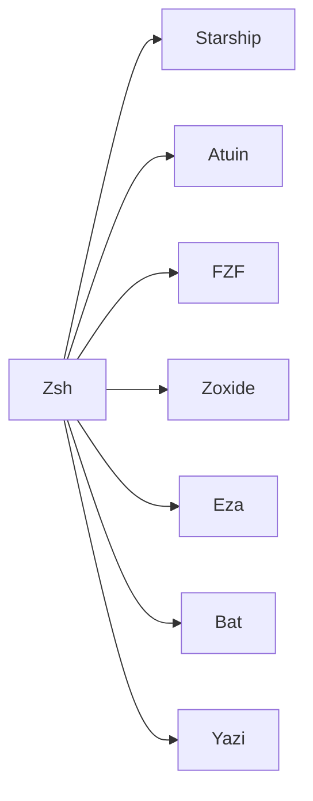

# Shell

## Chaîne interactive



| Élément | Rôle |
| --- | --- |
| Zsh | shell interactif et point d'intégration |
| Starship | prompt configuré par `starship/.config/starship.toml` |
| Atuin | recherche d'historique local ; base et clé exclues de Git |
| FZF | sélection interactive et prévisualisations |
| Zoxide | navigation par fréquence |
| Eza | affichage enrichi des répertoires |
| Bat | lecture et prévisualisation colorée |
| Yazi | gestionnaire de fichiers terminal |

`.zprofile` initialise la session graphique via UWSM lorsque son contexte le
permet. `.zshenv` publie le socket de l'agent SSH utilisateur. `.zshrc` charge
les intégrations interactives, aliases et fonctions.

## Plugins Zsh et Tmux

Les plugins ne sont pas téléchargés à chaque ouverture du shell. Git épingle
leurs commits comme sous-modules :

| Intégration | Chemin versionné |
| --- | --- |
| Fast Syntax Highlighting | `zsh/.zsh/plugins/fast-syntax-highlighting` |
| FZF Tab | `zsh/.zsh/plugins/fzf-tab` |
| Zsh Autosuggestions | `zsh/.zsh/plugins/zsh-autosuggestions` |
| Catppuccin Tmux | `tmux/.config/tmux/plugins/catppuccin/tmux` |

Initialisation et contrôle :

```bash
git submodule update --init --recursive
git submodule status --recursive
```

La configuration Zsh vérifie la lisibilité des fichiers de plugins avant de
les sourcer. Le dépôt parent, et non une commande lancée au démarrage du shell,
reste propriétaire des versions.

## Scripts utilisateur

Le package `bin` déploie des commandes dans `~/.local/bin`. Les familles
principales sont :

- maintenance Pacman/AUR (`aurinstall`, `aurremove`, `aursearch`, `aurupdate`) ;
- énergie et batterie (`batlimit`, `battery-low-notify.sh`, `tlp-profile.sh`) ;
- session et applications (`sway-close`, `thunderbird-proton`,
  `vmware-on-demand`, `nextcloud-sync`) ;
- développement local (`dcnvim`, `goose`, `pi-dev`, `opencode-away`) ;
- acquisition/3D (`colmap-amd`, `scan3d`, `scan3d-watch`) ;
- intégrations Trainlog (`trainlog-bt-watch`) et autres projets locaux.

Ces scripts orchestrent des outils existants ; ils ne fournissent pas les
projets externes, credentials ou binaires système qu'ils appellent. Consulter
[`external-tools.md`](../.assets/external-tools.md) avant de les réutiliser sur
une autre machine.

## Données locales

L'historique Zsh et le store Atuin sont des données utilisateur, pas de la
configuration. La clé, la base, les sessions et tout identifiant Atuin restent
hors Git. Cette installation utilise Atuin localement ; aucune procédure de
compte ou de synchronisation distante n'est requise par le dépôt.
